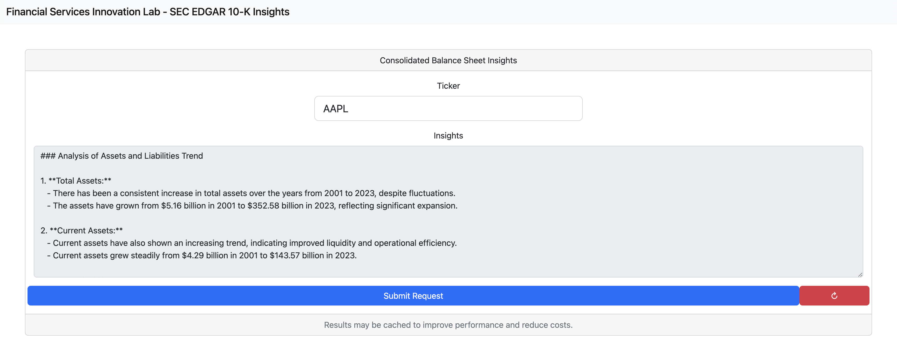

# SEC Data Analysis and Visualization Tool - Consolidated Balance Sheets

## Overview

This repository contains a project developed for the Financial Services Innovation Lab's Summer Research Programming Task at Georgia Tech as a take-home assignment. It allows users to lookup company tickers (those found on SEC EDGAR) and generate insights based on the consolidated balance sheets associated with the years 1995-present if available.

# Using the Application

## Prerequisites

- Install [python3.12](https://www.python.org/downloads/) and verify the installation
- Install [conda](https://conda.io/projects/conda/en/latest/index.html)
- Set the environment variables at the bottom of in `environment/financial_services_innovation_lab.yml`
  - IMPORTANT: Generate for an [OpenAI secret key](https://platform.openai.com/) and paste in the contents here
- Follow the instructions in `environment/README.md`
- Verify a stable internet connection, as filings may take a minute or more to download per request

## Running

- Launch the server via `python run.py` or by using the `launch.json` configuration within VScode

# Rationale on Technologies

- Python was chosen for its rich ecosystem, especially regarding ML and SEC related packages. It was also recommended by the project description
- flask is used as an API and view for the application. flask is known for its ease of use and high development speed. Because the UI is simply serving a static html page, templating is not necessary, and other potential speedups like SSR or ISR are irrelevant since the assumption is that the UI and BE are running on the same system.
- SQLite is used as a caching layer. Due to the time it takes to do many of these lookups as well as the costs associated with the external LLM API, caching is a necessity for repeated lookups of the same ticker.
- OpenAI's gpt3.5-turbo model was chosen for its speed, accuracy, and cost optimization. It is also relatively easy to get setup.
- pytest is used as a robust testing library to make sure as the project grows there are no regressions.
